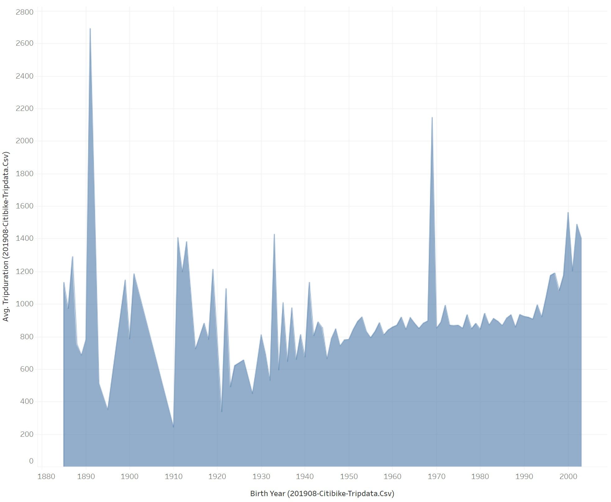

# Bikesharing

## Description
Using Tableau and bikesharing data from August 2019, a data visualization software to present a business proposal for a bikesharing company.

### Challenge Overview
Using data from the Citi Bike program in New York City, create visualization that would convince stakeholders to invest in a bike-sharing company. 

The framework for this project was to analyze bikeshare data from CitiBike in New York City for presentation to investors looking to begin a bikeshare program in Des Moines, Iowa. While Des Moines is a long way away from the hustle and bustle of NYC, this analysis might help answer a few key questions:

- Who uses bikeshare programs?
- What area of a city sees the most bikeshare usage?
- What time of day are bikes used the most and the least?
- How much are the bikes used and by whom?

### Approach
First, import the flat file, CSV data into Tableau. Next create and style worksheets, dashboards, and stories in Tableau. 
Then use Tableau worksheets to display data in a professional way. Finally, portray data accurately using Tableau dashboards.

### Results
This Tableau Story can be seen in its entirety: [link to dashboard](https://public.tableau.com/app/profile/yajaira.varillas.perez/viz/NYCCitiBikeAnalysisProject/NYCCitiBikeAnalysisProject?publish=yes "Click here!")

While the demographics of Des Moines may be different from the make up of the citizenry of NYC, a cursory look at the makeup of CitiBike riders may shine light on who bikeshare might appeal to, regardless of locale.
***

In the above image we can see that more than 3/4 of the users are **Subscribers**, who make regular use of the bikes and are a predictable source of income for the program. Bikeshare program users are also predominantly male, at approximately 5/8 to only about 1/4 female. The remaining 1/8 gender is unknown or undeclared.
***

The above map displays the bike stations from which recorded bike trips started. The size of the circles and darkness of the green indicate the relative number of trips started at those locations. It is apparent that the bulk of the bike trips are originating in the bustling **commercial heart** of Lower Manhattan, known for towering office buildings, densely packed residential skyscrapers, and entertainment venues. Bike usage is lower in the less densely packed surrounding neighborhoods. 
***

This chart displays the number of bike rides initiated during each hour of the day, totaled across the entire month of August. We can see peak usage during morning rush hour and end-of-workday commute times. What is also of note is the low-usage hours between 2 AM and 5 AM. These hours would be the best times to conduct **bike repairs** and **redistribution** of bikes from full stations to less-full stations.
***

A heatmap also helps show weekly usage patterns. Once again we can see the heavy bike usage during **weekday commute times**, and weekend usage is spread throughout the middle of the day. An interesting anomaly is the relatively low bike usage during Wednesday's end-of-day commute. It could be useful to explore reasons for this (system outage, Wednesday holidays in August, something less obvious?), but it could just be an arbitrary anomaly. Also, we can still see that low-usage time in the early morning hours, every day of the week.
***

This charting of average trip duration by birth year shows two things:
- The bikeshare userbase covers all age demographics, from teenagers to nonagenarians (and older);
- Teenagers and early-twenty-somethings enjoy taking much longer bikerides than older users.
***

This graphing of number of trips by duration show that the vast majority of trips taken on CitiBike bikes are under an hour in length. More specifically, most trips are under a half-hour in length, with a swift dropoff in number of rides over an hour in length.
***

This breakdown of number of rides by duration, separated by gender, makes it even more apparent how many more rides are taken by male-identifying customers.
***

Lastly, this heatmap reinforces how much of the userbase is dominated by male-identifying, subscribing users. Why this is the case is unclear and warrants additional study.

There are one or two additional charts available in the Tableau analysis, but they tell pretty much the same story that has already been displayed above.

### Summary

In conclusion, bikeshare services are remarkably popular in busy metropolitan areas, where occupied real estate is densely packed and parking spaces may be scarce. The user base is made up mostly of male subscribers, providing regular income to the program. More outreach should be done to attract female riders, but male users seem a reliable market. And main usage seems focused around morning and evening commute times.

If I were to pursue additional lines of inquiry for analysis and visualization, given the data provided, I would explore:

- Trip starting and ending locations during morning and evening rush hour time-windows, to display the flow of traffic between neighborhoods at peak hours;
- Average trip duration, by birth year, by gender, to explore if there was any difference in male or female or un-gendered riders as they age.

### Things I Learned
* Import data into Tableau.
* Create and style worksheets, dashboards, and stories in Tableau.
* Use Tableau worksheets to display data in a professional way.
* Portray data accurately using Tableau dashboards.
* Create a Tableau story based on starting a bike-sharing company in Des Moines.

### Software/Tools
Tableau
